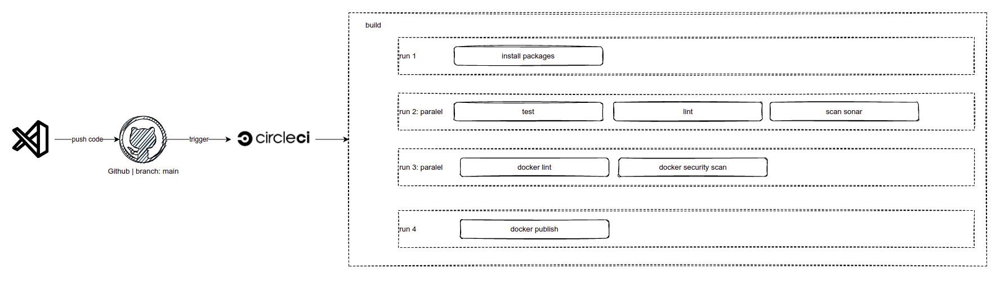

<h1 align="center">Welcome to nodejs-demo-app 👋</h1>
<p>
  
  <a href="TODO" target="_blank">
    
  </a>
  <a href="https://github.com/olucasfagundes/nodejs-demo-app/blob/main/LICENSE" target="_blank">
    
  </a>
  <a href="https://twitter.com/olucasfagundes" target="_blank">
    
  </a>
</p>

[](<LINK>)

[](https://sonarcloud.io/dashboard?id=nodejs-demo-app)


> This is a simple Node.js web app using the Express framework and EJS templates. The app has been designed with cloud native demos & containers in mind, in order to provide a real working application for deployment, something more than "hello-world" but with the minimum of pre-reqs. It is not intended as a complete example of a fully functioning architecture or complex software design.

### 📦 [Docker Hub Repository](https://hub.docker.com/r/olucasfagundes/nodejs-demo-app/tags?page=1&ordering=last_updated)

## CI Overview
  
[CircleCI Pipeline](https://app.circleci.com/pipelines/github/olucasfagundes/nodejs-demo-app/)




## Install

```sh
npm install
```

## Usage

```sh
docker run -d -p <port>:3000 olucasfagundes/nodejs-demo-app:<tag>
```

## Run tests

```sh
npm test
```

## Author

👤 **Lucas Fagundes**

* Twitter: [@olucasfagundes](https://twitter.com/olucasfagundes)
* Github: [@olucasfagundes](https://github.com/olucasfagundes)
* LinkedIn: [@lucas-fagundes](https://linkedin.com/in/lucas-fagundes)

## Show your support

Give a ⭐️ if this project helped you!

## 📝 License

Copyright © 2021 [Lucas Fagundes](https://github.com/olucasfagundes).<br />
This project is [MIT](https://github.com/olucasfagundes/nodejs-demo-app/blob/main/LICENSE) licensed.

***
_This README was generated with ❤️ by [readme-md-generator](https://github.com/kefranabg/readme-md-generator)_
